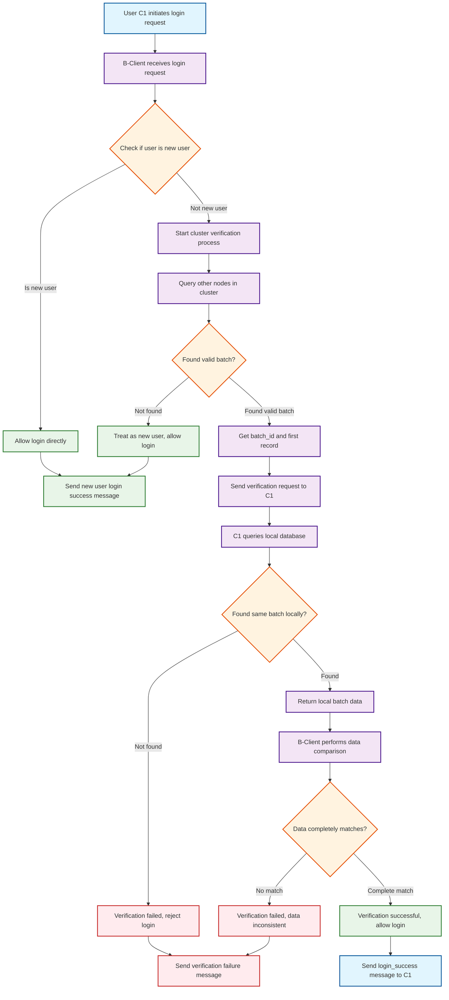
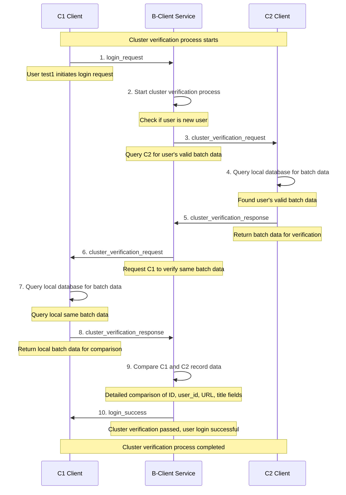

# Cluster Verification Simplified Flow Diagram

## Cluster Verification Process

## Cluster Verification Sequence Diagram

## Key Verification Fields

### Data Consistency Check
- **User Identifier**: `user_id` must match exactly
- **Activity Records**: `url`, `title`, `activity_type` must be consistent
- **Timestamp**: `created_at` must be the same
- **Record ID**: `id` must match
- **Description**: `description` must be consistent

### Security Verification Mechanism
- **Cluster Verification**: Ensure user is in the same cluster
- **Data Integrity**: Prevent data tampering
- **Timeliness Check**: Prevent replay attacks
- **Node Consistency**: Multi-node data synchronization verification
